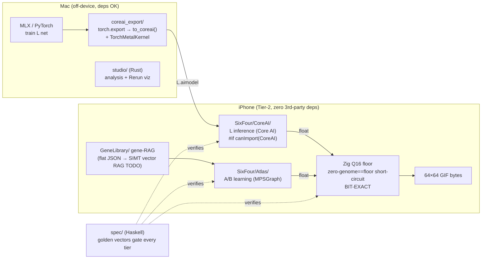

# SixFour NN Stack — canonical map

> **The single orientation document for the LAB-channel NN pivot.** It replaces
> the sunset `docs/*.md` plans (`ON-DEVICE-TRAINING.md`, `COLOR-ATLAS.md`,
> `STATUS.md`, the migration workflows) that code comments still cite. Those plans
> were deleted; their *essentials* now live here plus in the purpose-headers of
> the files themselves. Keep the **Unfinished work** section honest by running
> `scripts/find-stubs.sh`. Last reconciled: **2026-06-20**.

---

## TL;DR — the pivot (decided 2026-06-20)

Train the heavy, universal **L (grayscale)** net on a Mac, deploy it to the
iPhone via **Apple Core AI** for *inference only*. Keep the chromatic **A / B**
channels learning **on-device** with **MPSGraph**, because Core AI cannot train.
Every float result re-enters the **Zig Q16 integer floor** so the GIF stays
bit-exact cross-device.

Gate verdict (deep-verified, adversarially refuted — see *Sources*): **PARTIAL.**

| Channel | LAB axis | Gate | Engine | Why |
|---|---|---|---|---|
| **L** | grayscale (luma) | ✅ **GO** | MLX (Mac train) → `coreai-torch` → `.aimodel` → **Core AI** infer on device | L is a *frozen* pretrained net; Core AI inference is confirmed real (a verifier installed `coreai-torch 0.4.0` and ran inference matching PyTorch to 6 d.p.) |
| **A** | R−G (red↔green) | 🟡 **conditional** | **MPSGraph** on-device (`SixFour/Atlas/`) | trainer loop is real but a **spike**; on-device latency/thermals unproven on hardware |
| **B** | (R+G)−B (yellow↔blue) | 🔴 **NO-GO (yet)** | MPSGraph + Zig | `NetSynth256` 256³ super-res is a zero-weight scaffold; federation is simulation-only; gene-RAG is flat JSON |

---

## The cube ladder (why one operator covers everything)

The product is **one reversible morphism** applied at three rungs:

```
        collapse (down, 4:1)                 lift / super-res (up, 1:4)
16³  ◀───────────────────────  64³  ───────────────────────▶  256³
        (2×2)×(2×2) → 1                       1 → (2×2)×(2×2)

        16³ : 64³   ==   64³ : 256³      (self-similar — same kernel both ways)
```

- Owned in **Zig** (`Native/src/`, `s4_voxel_reduce` / Haar path) as the
  byte-exact integer source of truth, mirrored by the Haskell spec
  (`spec/src/.../CubeLadder.hs`, `RGBTLift.hs`, `VoxelReduce.hs`,
  `lawVoxelReduceBijective`) and the Swift orchestration (`SixFour/RGBT4D/`).
- **LAB compresses on collapse and stretches on lift.** L is the achromatic
  (σ-invariant) base; A and B are the chromatic fibers over it. The curriculum
  trains the morphism on L first (where `a=b=0` degenerates the loss), then lifts
  to the A/B fibers — the "category-theory curriculum."

---

## Three tiers (where the pivot lives)

| Tier | Lives in | Role | Pivot action |
|---|---|---|---|
| **Mac training** (off-device) | `trainer/` (MLX, PyTorch), `studio/` (Rust analysis + Rerun viz) | train the heavy L net; analyse | **NEW** `trainer/coreai_export/` = the L→`.aimodel` bridge |
| **Deploy bridge** | `trainer/coreai_export/` + `Native/` | PyTorch→Core AI IR; embed owned Metal kernels | `coreai-torch` `TorchConverter().to_coreai()`; `TorchMetalKernel` ships SixFour's kernels *inside* the asset |
| **On-device** | `SixFour/` | inference + per-user learning + capture | **NEW** `SixFour/CoreAI/` = L inference; `Atlas/` = A/B MPSGraph training (unchanged engine) |

---

## Boundary rule (pin this — it is the contract)

- **Core AI = inference / deploy of L only.** It is *inference-only*
  (confirmed); it cannot train. Apple-Silicon only; developer-beta (GA ~Sept
  2026); **absent from the iOS Simulator SDK** (`coreai-models` issue #49) → guard
  every use with `#if canImport(CoreAI)`; verifiable only on a real device.
- **MPSGraph / Zig = all on-device LEARNING.** A/B per-user training stays on
  MPSGraph (`gradients(of:with:)` + SGD + `assign`, iOS 14+, GA).
- **Zig Q16 = the only cross-device BIT-EXACT substrate.** Core AI / MPSGraph
  float output is *not* bit-exact across devices, so it must short-circuit through
  the **`zero-genome == floor`** path back into the Zig integer pipeline before it
  can reach the GIF bytes. Never let a float touch the output directly.
- Unchanged from the original contract: **never `mlx-swift`, never any
  third-party dependency in the shipped app.** `CoreAI.framework` is permitted
  *only* because it is an Apple system framework, and *only* for L inference.

---

## What is real vs. stub (keep honest with `scripts/find-stubs.sh`)

**Real & shipping:**
- Zig native core — 33 golden-gated exports, byte-exact (`Native/`).
- Metal kernels — KMeans / BlueNoise / NearestCentroid / `field.metal` (`SixFour/Metal/`).
- MPSGraph training loop — real autodiff+SGD (`SixFour/Atlas/AtlasTrainer.swift`).
- MLX L-net trainer — `trainer/train_look_net_mlx.py` (halting + GAN + Bures).
- Haskell spec — source of truth, golden-gated.

**Stub / unfinished (the pivot's real work-list):**
- `AtlasTrainer.swift` is a **SPIKE**: no σ-masks, no 24-D σ-invariant
  projection, policy heads unbuilt. Promote to the production value/policy head.
- **256³ super-res is hollow**: `Spec.ExportFamily.synthDetail` and
  `lawZeroGenomeIsFloor` are `error "TODO"`; `NetSynth256` is a zero-weight
  scaffold (== floor at zero genome). This is the critical path.
- **Federation does not exist as product code**: `trainer/fed_sim.py` is a
  *simulation* with isotropic-Gaussian features (its authors' stated limitation).
  No on-device merge client; no privacy/consent/transport design.
- **Gene-RAG is a flat JSON store** (`SixFour/GeneLibrary/GeneStore.swift`,
  linear nearest, cap 64), **not** the CVT-MAP-Elites / `genomeInner` vector RAG
  on a SIMT substrate the pivot describes.

---

## Stack diagram



(An existing graphical view lives at `spec/spec-graph-nn.svg`; the Rust `studio/viz`
crate drives a Rerun timeline. Extend those rather than adding a new viz tool.)

---

## Sources (deep-verified 2026-06-20, adversarially refuted)

- Core AI framework — https://developer.apple.com/documentation/coreai · WWDC26 sessions [324](https://developer.apple.com/videos/play/wwdc2026/324/), [326](https://developer.apple.com/videos/play/wwdc2026/326/)
- `apple/coreai-torch` (PyTorch→Core AI IR, `TorchMetalKernel`) — https://github.com/apple/coreai-torch · https://apple.github.io/coreai-torch/main/
- `apple/coreai-models` · Simulator gap issue #49 — https://github.com/apple/coreai-models/issues/49
- MLX on-device training (MNISTTrainer trains on iOS) — https://github.com/ml-explore/mlx-swift-examples
- MPSGraph on-device training (GA, iOS 14+) — https://developer.apple.com/documentation/metalperformanceshadersgraph/training-a-neural-network-using-mps-graph
- Apple Newsroom (WWDC26) — https://www.apple.com/newsroom/2026/06/apple-aids-app-development-with-new-intelligence-frameworks-and-advanced-tools/
- Federated personalization via model merging (FedMerge) — https://arxiv.org/pdf/2504.06768
- On-device vector RAG (VecturaKit) — https://github.com/rryam/VecturaKit
